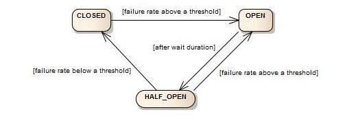

# Resilience4j

# Retry

Se uma instância caiu podemos tentar novamente. Para tentar novamente utilizamos o

> @Retry

Podemos,

* implementar um método de fallback,
* escolher o número de retentativas antes de ir para o método de fallback,
* escolher o tempo entre as tentativas,
* o tempo pode ser exponencial

# Circuit Break

Quando temos um ambiente distribuído podemos ter uma interdependência muito grande. Se uma peça falhar, pode ser que
outra peça não consiga executar uma ação corretamente. Nesse caso pode ser interessante interromper um determinado
fluxo.
Teríamos um mecanismo parecido com um disjuntor, aonde o fluxo total seria interrompido para evitar maiores problemas.

No nosso caso várias chamadas são feitas via HTTP de maneira síncrona e no caso de uma falha, pode ser interessante
interromper o fluxo inteiro para não desperdiçar recurso ou aumentar o problema.

> @CircuitBreaker

Fonte: https://resilience4j.readme.io/docs/circuitbreaker

Definimos:

1. nossa unidade de tentativas(tempo ou quantidade),
2. o quantitativo baseado nas unidades acima para tentarmos,
3. limite de falhas que aceitamos antes de interromper o circuito,
4. tempo que deixamos o circuito aberto para ele poder se recuperar,
5. número de tentativas que tentamos com o circuito parcialmente aberto.

# Rate Limiter

Limita o número de chamadas/tempo a uma função.

Nesse caso nós podemos interromper o fluxo caso um alto número de requests em um curto período.

# Bulkhead

No caso do Bulkhead ele limita a quantidade de operações concorrentes que estão chamando a função.

# Bibliografia

* https://resilience4j.readme.io/docs/circuitbreaker
* https://www.baeldung.com/resilience4j