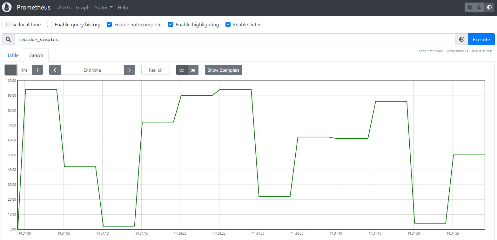
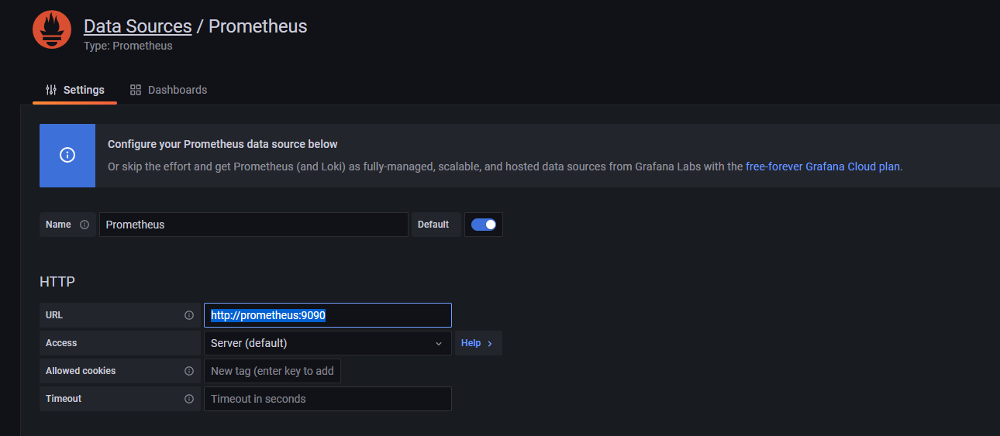
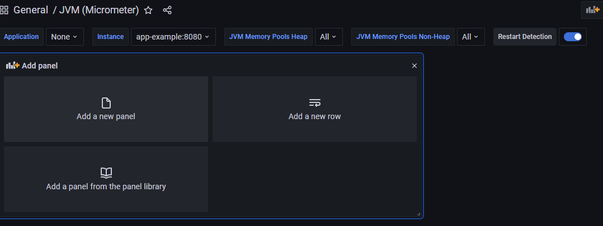
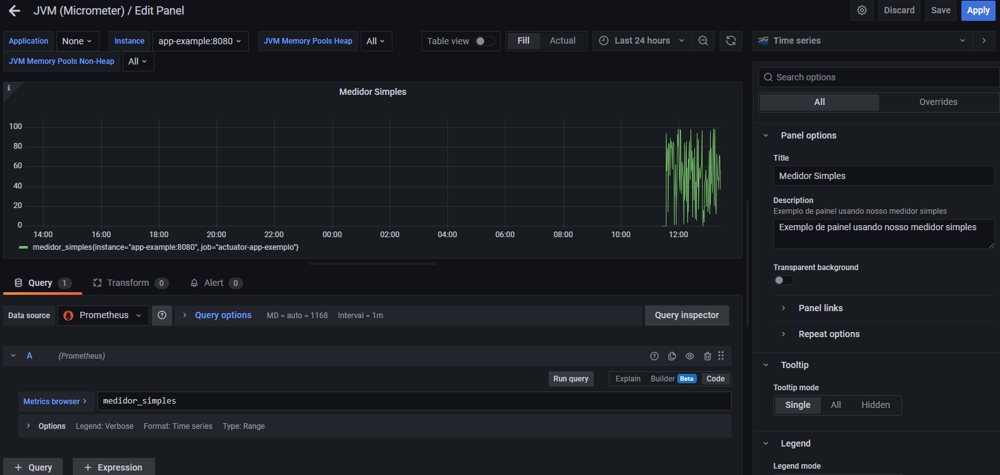

# Monitoramento

Imagine que temos um conjunto de aplicações que trabalham juntas. O banco de dados contendo os usuários teve um problema
de disco e com isso o serviço de autenticação pardeu a comunicação com o banco e consequentemente não consegue mais
funcionar corretamente. Nesse caso a única mensagem que vamos obter é que a autenticação não foi efetuada com sucesso.
Como achar então a falha em um ambiente distribuído?

O nosso monitoramento agora vai ser feito seguindo o fluxo.

App -> Prometheus -> Grafana

Criamos assim a nossa imagem da aplicação a ser monitorada para posterior uso no docker-compose

> mvn spring-boot:build-image -Dspring-boot.build-image.imageName=letscode/actuator

# Micrometer

Bibliografia: https://micrometer.io/docs/concepts

O micrometer vai servir como um tradutor para gerarmos métricas que serão compatíveis com diversas plataformas de
mercado como o Prometheus.

Ele foi incorporado ao Spring Actuator 2 como mecanismo padrão para exportar métricas, bastando adicionar a dependência
abaixo para fazer a integração com o Prometheus.

    <dependency>
        <groupId>io.micrometer</groupId>
        <artifactId>micrometer-registry-prometheus</artifactId>
    </dependency>

No arquivo de propriedades, basta adicionar as seguintes linhas:

    management:
        endpoints:
            web:
                exposure:
                    include: '*'
        metrics:
            export:
                prometheus:
                    enabled: true
        endpoint:
            metrics:
                enabled: false
            prometheus:
                enabled: true

## Personalização de métricas

Podemos criar nossas próprias métricas personalizadas para expor ao Prometheus.

* Counter: Contador
* Gauge: Valor de uma métrica
* Timers: Medida de latência ou frequência de eventos
* DistributionSummary: Distribuição de eventos ou sumário simples

[Exemplo](../actuator/src/main/java/br/com/pinho/cursos/java/monitoramento/actuator/metrics/SimpleMetric.java)

Observar as nossas métricas em http://localhost:9391/actuator/prometheus

# Prometheus

Prometheus é um conjunto de ferramentas open source, originalmente construído pela SoundCloud, para monitoramento de
sistemas e gerenciamento de alerta. Ele pode obter métricas de microservicos, de projetos de diferentes linguagens, de
servidores.

Para obter métricas de servidores que, por exemplo, não possui um endpoint como o actuator, utilizamos o conceito de
[exporter](https://prometheus.io/docs/instrumenting/exporters/).

## Configuração

Bibliografia: https://prometheus.io/docs/prometheus/latest/getting_started/#configuring-prometheus-to-monitor-itself

[Arquivo de configuração](/config/prometheus.yml)

Prometheus tem um componente chamado **AlertManager** que faz integrações com vários canais diferentes para enviar os
alerta. Como slack, e-mail, dentre outros

## Executando

Vamos criar um docker compose que vai subir tanto a nossa aplicação como também o prometheus.

[compose](/docker-compose.yml)

## Navegando

Podemos consultar nossa métrica.

# Grafana

Grafana é um ‘software’ aberto de análises e visualização de métricas.

Ele possui uma ‘interface’ aonde é possível uma vasta personalização para obter que formato quisermos das nossas
métricas.

Por ser muito utilizado é muito fácil achar várias personalizações de visualizações já prontas para uso.

# Execução

> docker run -d -p 3000:3000 grafana/grafana

ou

[compose](/docker-compose.yml)

# Configurando

O Grafana já possui um sistema de autenticação próprio que já nos ajuda bastante, já que não precisamos ter essa
preocupação com o monitoramento. Para iniciar basta usar usuário e senha como **admin**

A primeira configuração que temos que fazer é obter configurar as fontes de dados.

1. Configuration > Data Sources
2. Adicione uma fonte do tipo Prometheus
3. Configure a URL 

# Dashboards

Em dashboard você pode adicionar um modelo de dashboard no import ou criar um dashoboard novo.

## Importando um novo dashboard

Exemplo: ID: 4701

## Criando painel personalizado

# Bibliografia:

* https://micrometer.io/docs/concepts
* https://prometheus.io/docs/prometheus/latest/getting_started/#configuring-prometheus-to-monitor-itself
* https://prometheus.io/docs/instrumenting/exporters/
* https://grafana.com/blog/2022/04/26/set-up-and-observe-a-spring-boot-application-with-grafana-cloud-prometheus-and-opentelemetry/
* https://ordina-jworks.github.io/monitoring/2020/11/16/monitoring-spring-prometheus-grafana.html
* https://mokkapps.de/blog/monitoring-spring-boot-application-with-micrometer-prometheus-and-grafana-using-custom-metrics/

