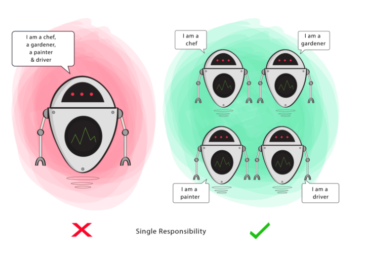
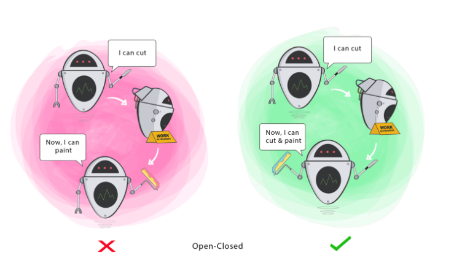
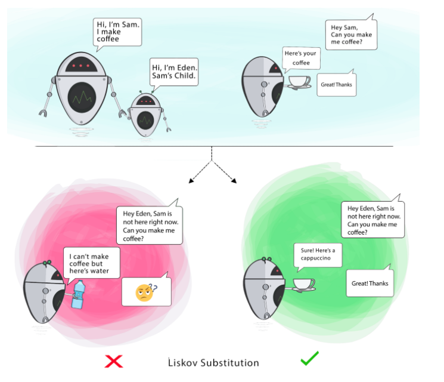
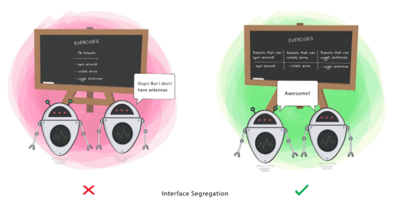
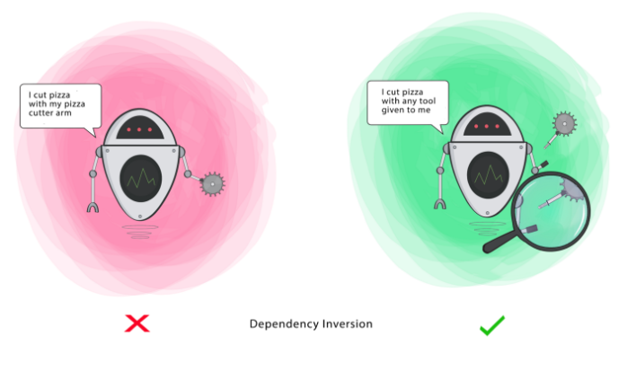

**S.O.L.I.D**:

- **S** - Single Responsiblity Principle
- **O** - Open-Closed Principle
- **L** - Liskov Substitution Principle
- **I** - Interface Segregation Principle
- **D** - Dependency Inversion Principle

# S - Single Responsiblity Principle

O princípio da responsabilidade única diz que uma classe deve ter apenas uma responsabilidade, e consequentemente,
apenas um motivo para ser alterada.

Isso evita que tenhamos que mexer em uma classe devido a um motivo e quebremos alguma outra funcionalidade que independe
do motivo daquela alteração.

Fonte: https://medium.com/backticks-tildes/the-s-o-l-i-d-principles-in-pictures-b34ce2f1e898

# O

Fonte: https://medium.com/backticks-tildes/the-s-o-l-i-d-principles-in-pictures-b34ce2f1e898

# L

Fonte: https://medium.com/backticks-tildes/the-s-o-l-i-d-principles-in-pictures-b34ce2f1e898

# I - Interface Segregation Principle

O princípio da segregação das interfaces diz que uma interface deve ser o mais específica possível, de modo que uma
pessoa que queira implementar ela não tenha que implementar um método que não faça sentido para aquela classe.

Fonte: https://medium.com/backticks-tildes/the-s-o-l-i-d-principles-in-pictures-b34ce2f1e898

# D

Fonte: https://medium.com/backticks-tildes/the-s-o-l-i-d-principles-in-pictures-b34ce2f1e898
