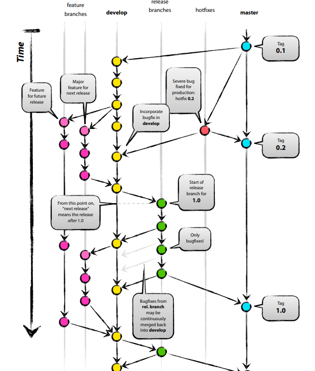
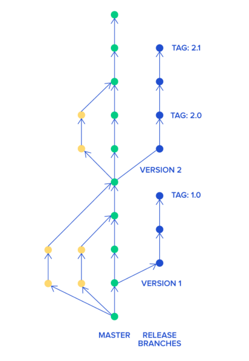
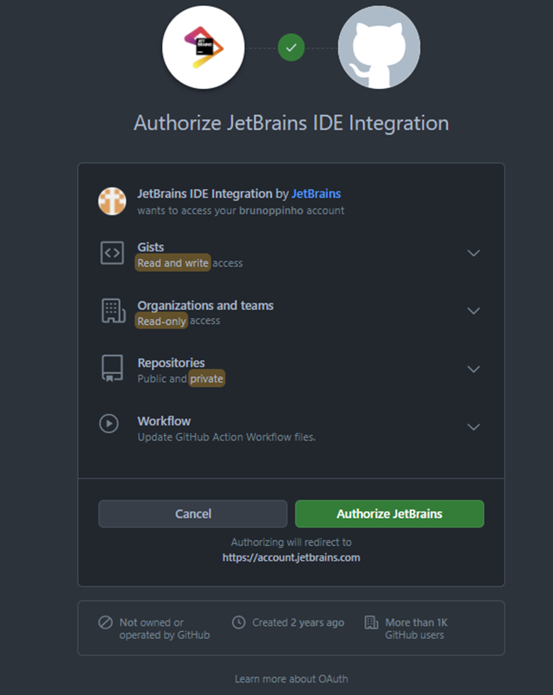

# Git

Sistema de controle de versão mais utilizado no mundo hoje.

Projeto de código aberto.

Sistema de controle de versão distribuído.

https://www.atlassian.com/br/git/tutorials/what-is-git

## Comandos

Principais comandos:

* Clonar um repositório `git clone <https://name-of-the-repository-link>`
* Criar uma branch local para desenvolver`git branch <branch-name>`
* Enviar a branch local para o repositório `git push -u <remote> <branch-name>`
* Listar as branchs `git branch --list`
* Apagar uma branch local `git branch -d <branch-name>`
* Escolher uma branch local para trabalhar `git checkout <name-of-your-branch>`
* Escolher uma branch remota para trabalhar e criar ela localmente`git checkout -b <name-of-your-branch>`
* Obtém várias informações uteis `git status`
* Adiciona um arquivo `git add <file>`
* Adiciona todos os arquivos de uma vez `git add -A`
* Grava suas alterações `git commit -m "commit message"`
* Envia suas alterações para o repositório `git push <remote> <branch-name>` ou `git push -u origin <branch_name>`
* Busca as alterações do repositório `git pull`

https://www.freecodecamp.org/news/10-important-git-commands-that-every-developer-should-know/
https://git-scm.com/docs

## Fluxos de desenvolvimento

Gitflow e desenvolvimento baseado em tronco são os dois padrões para fluxo de desenvolvimentos mais utilizados no git

### GitFlow

O Gitflow, popularizado primeiro, é um modelo de desenvolvimento mais rigoroso, onde apenas certos indivíduos podem
aprovar alterações no código principal. Essa restrição mantém a qualidade do código e minimiza o número de bugs.

### Desenvolvimento baseado em tronco

O desenvolvimento baseado em tronco é um modelo mais aberto, já que todos os desenvolvedores têm acesso ao código
principal. Assim, as equipes podem iterar rápido e implementar CI/CD.

### Comparação

| GitFlow                                                   |                            Tronco                             |
|-----------------------------------------------------------|:-------------------------------------------------------------:|
| O mais distante possível da branch principal              |          O mais próximo possível da branch principal          |
| Nova feature nasce da branch de desenvolvimento           |        Nova feature nasce da branch principal, master         |
| Utilizados em times com desenvolvedores menos experientes | Funciona melhor com time com desenvolvedores mais experientes |
| Menos sujeito a falhas na branch principal                |                  Desenvolvimento mais rápido                  |

### Referências

https://www.atlassian.com/br/continuous-delivery/continuous-integration/trunk-based-development
https://medium.com/@vafrcor2009/gitflow-vs-trunk-based-development-3beff578030b
https://www.devbridge.com/articles/branching-strategies-git-flow-vs-trunk-based-development/

## GitHub

GitHub é uma plataforma de hospedagem de código-fonte e arquivos com controle de versão usando o Git. Ele permite que
programadores, utilitários ou qualquer usuário cadastrado na plataforma contribuam em projetos privados e/ou Open Source
de qualquer lugar do mundo. [Wikipedia](https://pt.wikipedia.org/wiki/GitHub)

Devido a alterações na política de segurança do github, caso você queira acessar o repositório usando a linha de comando
é necessário criar um token de acesso pelo
link: https://docs.github.com/en/authentication/keeping-your-account-and-data-secure/creating-a-personal-access-token

## IntelliJ com GitHub

O IntelliJ é integrado com o git de modo que é possível utilizar as principais funcionalidades utilizando a própria IDE
ou também é possível utilizar o terminal para executar os comandos git.

Siga o tutorial: https://www.jetbrains.com/help/idea/github.html#register-account

### Importar projeto

`VCS` menu -> `Share project on GitHub`.

